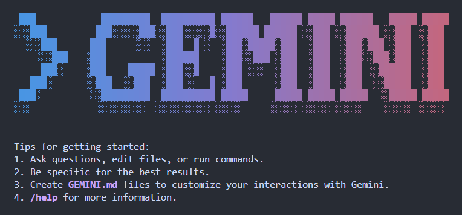
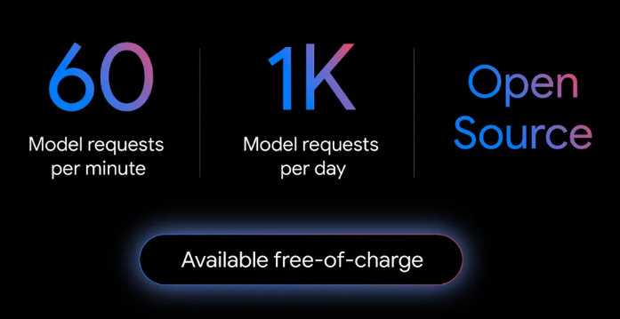
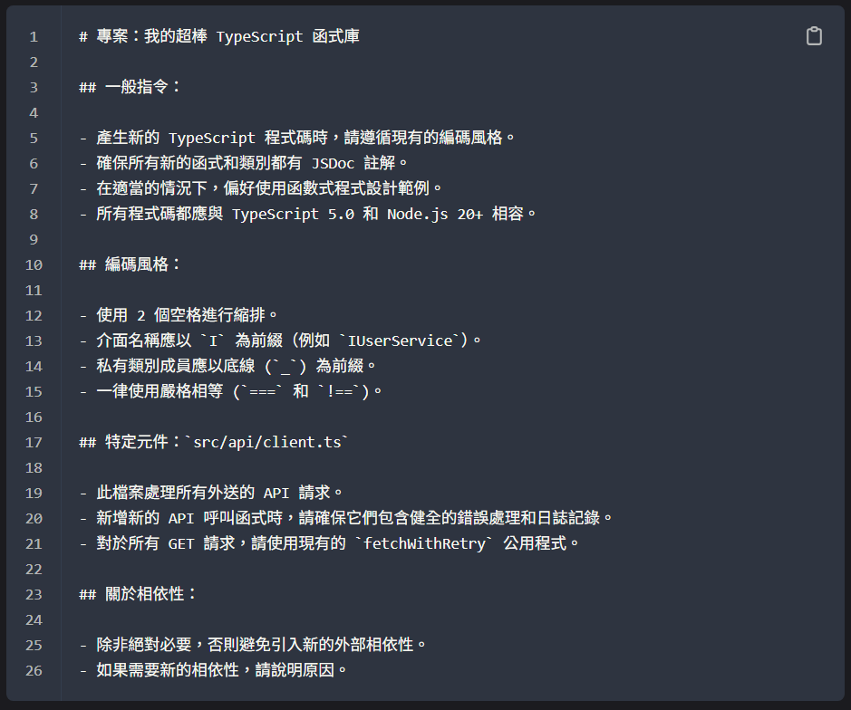
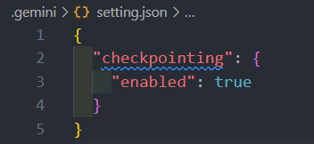
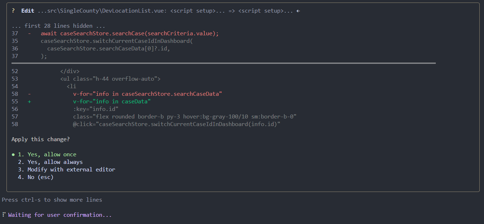
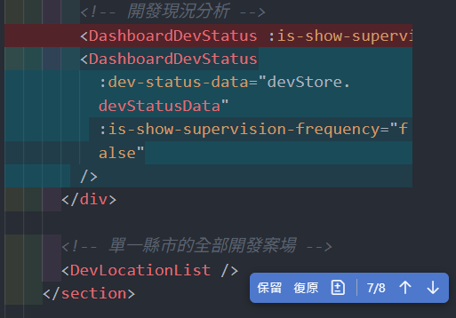

---
# You can also start simply with 'default'
theme: the-unnamed
# random image from a curated Unsplash collection by Anthony
# like them? see https://unsplash.com/collections/94734566/slidev
background: https://cover.sli.dev
# some information about your slides (markdown enabled)
title: 🌟 Gemini CLI 介紹說明
info: |
  ## Gemini CLI 介紹說明
  Google 推出的 終端機 AI Agent 工具

  Learn more at [Google AI](https://ai.google.dev)
# apply unocss classes to the current slide
class: text-center
# https://sli.dev/features/drawing
drawings:
  persist: false
# slide transition: https://sli.dev/guide/animations.html#slide-transitions
transition: slide-left
# enable MDC Syntax: https://sli.dev/features/mdc
mdc: true
# show slide number
lineNumbers: false
# show page number in SPA build, can be boolean, string (for custom format), or a configuration object
paginate: true
# open graph
seoMeta:
  # By default, Slidev will use ./og-image.png if it exists,
  # or generate one from the first slide if not found.
  ogImage: auto
  # ogImage: https://cover.sli.dev
---

# Gemini CLI 介紹

<span class="text-xl">駱筱尹 2025 / 08</span>

<!-- <div @click="$slidev.nav.next" class="mt-12 py-1" hover:bg="white op-10">
  Press Space for next page <carbon:arrow-right />
</div>

<div class="abs-br m-6 text-xl">
  <button @click="$slidev.nav.openInEditor()" title="Open in Editor" class="slidev-icon-btn">
    <carbon:edit />
  </button>
  <a href="https://ai.google.dev" target="_blank" class="slidev-icon-btn">
    <carbon:logo-google />
  </a>
</div> -->

<!--
The last comment block of each slide will be treated as slide notes. It will be visible and editable in Presenter Mode along with the slide. [Read more in the docs](https://sli.dev/guide/syntax.html#notes)
-->

---

# 什麼是 Gemini CLI？

Google 推出的 **終端機 AI Agent 工具** <br />
可使用自然語言與 AI 對話或進行程式碼修改

<div class="grid grid-cols-2 gap-8 pt-8">
  <!-- <div>
    <h3 class="mb-3">🤖 核心功能</h3>
    <ul>
      <li>終端機內 AI 對話</li>
      <li>程式碼修改</li>
      <li>輕量級解決方案</li>
      <li>開發者 AI 工作流程</li>
    </ul>
  </div> -->
  <div>
    <h3 class="mb-3">🧠 AI 模型</h3>
    <ul>
      <li><strong>預設：</strong>gemini-2.5-pro<br><small class="opacity-70">（目前免費）</small></li>
      <li><strong>備用：</strong>gemini-2.5-flash<br><small class="opacity-70">（不適合程式碼修改）</small></li>
    </ul>
  </div>
  <div>
    
  </div>
</div>

<style>
/* h1 {
  background-color: #4285f4;
  background-image: linear-gradient(45deg, #4285f4 10%, #34a853 20%);
  background-size: 100%;
  -webkit-background-clip: text;
  -moz-background-clip: text;
  -webkit-text-fill-color: transparent;
  -moz-text-fill-color: transparent;
} */
</style>

---

# 使用額度與費用說明

<div class="grid grid-cols-2 gap-8">
  <div>
    <ol>
      <li><strong>CLI 工具：</strong>開源且免費</li>
      <li><strong>語言模型：</strong>依 Token 使用量計費</li>
      <li><strong>免費使用限制：</strong>
        <ul class="mt-2">
        <li>📊 每分鐘：<span class="font-bold text-amber-400">60 次</span>請求</li>
        <li>📅 每天：<span class="font-bold text-amber-400">1000 次</span>請求</li>
      </ul>
      </li>
    </ol>
  </div>
  <div class="flex  content-end mt-20">
    

  </div>
</div>

---

# 安裝與啟動方式

<div >

### 1️. 安裝 Node.js 版本 **20 以上**

</div>

<div class="mt-4">

### 2. 安裝 Gemini CLI

```bash
npm install -g @google/gemini-cli
```

</div>

<div class="mt-4" >

### 3️. 啟動 CLI

```bash
gemini
```

</div>

<div class="mt-4">

### 4️. 登入 Google 帳戶

</div>

<style>
/* 針對這個頁面的 bash 程式碼區塊樣式 */
.slidev-code {
  font-size: 1.3em !important;
  padding: 1.5rem !important;
  border-radius: 0.75rem;
}

pre code {
  font-size: 1.3em !important;
  line-height: 1.6;
}
</style>

---

# 使用 GEMINI.md 提供背景知識

<!-- 利用專案根目錄的 `GEMINI.md` 檔案，為 AI 提供專案背景與需求資訊 -->

<div class="grid grid-cols-2 gap-8">

  <div>
    <div class="mb-8">
      <h2 class="mb-2">核心功能</h2>
      <ol>
        <li>在專案根目錄建立 GEMINI.md</li>
        <li>CLI 執行時自動讀取該檔案</li>
        <li>提供 AI 專案背景與需求資訊</li>
      </ol>
    </div>
    <div>
      <h2 class="mb-2">階層式套用</h2>
      <ol>
        <li>子資料夾內也可建立 `GEMINI.md`</li>
        <li>針對不同資料夾給不同說明</li>
        <li>/memory show 查看目前載入的所有記憶內容</li>
      </ol>
    </div>
  </div>

  <div>
    
  </div>

</div>

---

<h1 >還原功能 /restore</h1>

<div class="grid grid-cols-2 gap-12">
  <div>
    <div class="flex gap-4 items-center mb-4">
      <h3 class="">啟用</h3>
      <span class="bg-orange-100 text-orange-800 px-3 py-1 rounded-full text-sm font-medium">
      ⚠️ 預設未啟用</span>
    </div>
    <ul class="space-y-2">
      <li>需於設定檔中啟用 check point 功能</li>
      <li>對修改前的檔案做快照備份</li>
      <li>可透過 /restore 指令還原</li>
    </ul>

  </div>
  <div>
    
  </div>
</div>

---

# 測試切版


---

# 切版針對特定區塊詳細描述

### 指令

<p class="text-base">依照圖片 @src/assets./images/test/info_part.png
再搭配我的文字描述調整，描述如下注意圖片區塊，有六張，六張總共佔了整個寬度的 6/7，且圖片是有規律的單數照片高度不動、雙數照片會比單數照片高一點點。左上淨灘資訊標題的方框會被壓在圖片下面</p>


---

# 實際使用心得與限制

<div grid="~ cols-2 gap-8" class="grid-cols-2 gap-8">

<div>

<div >

## ✅ 優點

<div class="bg-green-50 p-4 rounded-lg border border-green-200 mt-4">
  <ul class="space-y-2 text-green-800">
    <li>在終端機內即可完成 AI 編輯</li>
    <li>搭配 GEMINI.md 可提供完整專案背景</li>
    <li>使用上直覺</li>
  </ul>
</div>

</div>

</div>
<div>

<div >

## ❌ 缺點

<div class="bg-red-50 p-4 rounded-lg border border-red-200 mt-4">
  <ul class="space-y-2 text-red-800 ">
    <li>想調整 AI 修改內容不如 VSCode Copilot 便利</li>
    <li>修改內容過長時，終端機難以完整檢視</li>
  </ul>
</div>

</div>

</div>
</div>

<div  class="mt-6 p-4 border border-purple-200 rounded-lg">
  <h3 class=" mb-2">🧑‍💻 個人偏好</h3>
  <p class=" ">
    在 VSCode 中使用 Copilot Agent 模式，使用 Claude Sonnet 4 模型，可直接在程式碼區塊調整 AI 的修改、直接在 Chat 區塊與 AI 溝通。
  </p>
</div>

---

# AI 修改內容方式 - Gemini

  <div>
    Gemini
    
  
  </div>
---

# AI 修改內容方式 - Copilot

  <div>
    Copilot
    
  
  </div>

---

<div class="text-center content-center h-full text-2xl">~ 謝謝聆聽 ~</div>
